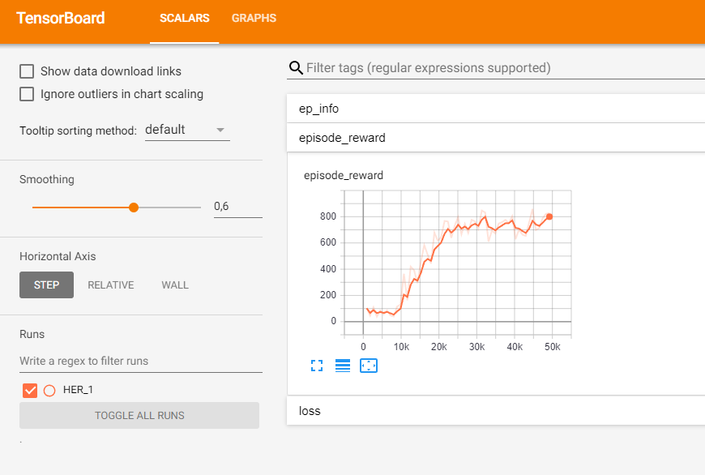
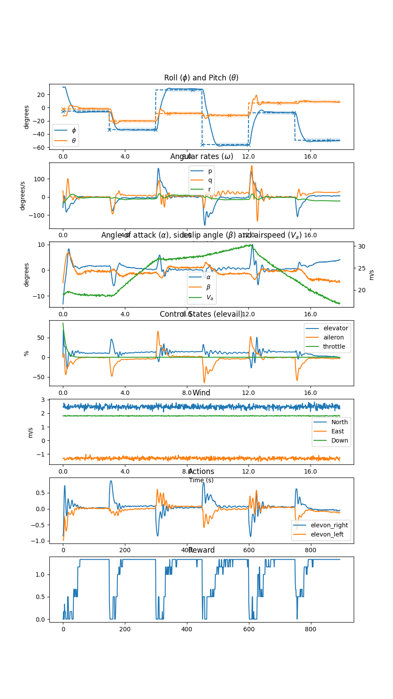
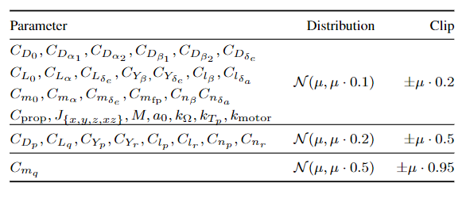

# Data-Efficient Deep Reinforcement Learning for Attitude Control of Fixed-Wing UAVs: Field Experiments

This repository contains the models used and code to produce these models as presented in the [accompanying paper](https://arxiv.org/abs/2111.04153). 
The config folder contains configuration files for both environment and for the reinforcement learning algorithm. The data
folder contains the test-set as described and used in the paper, as well as a separate validation set used during training and
development of the reinforcement learning models. The models used to produce the results of the paper are included in the
models folder.

The reinforcement learning code is based on the [stable-baselines](https://stable-baselines.readthedocs.io/en/master),
while the simulator we pre-train the learning controllers on is [pyfly](https://github.com/eivindeb/pyfly) with the 
[gym-fixed-wing](https://github.com/eivindeb/fixed-wing-gym) wrapper.

## Installation
Tested with Python 3.7 (<=3.7 is required for Tensorflow 1)
```shell
git clone https://github.com/eivindeb/rluav
cd rluav
pip install -r requirements.txt
```

## Training
Reinforcement learning attitude controllers can be trained using the provided train_controller.py script. This script
takes as arguments a path to save the controller model to, and if training a new controller (as opposed to continuing 
training from a checkpoint) takes paths to environment (gym-fixed-wing), simulator (pyfly), and RL (stable-baselines)
configuration files, as well as optional tensorboard ip and port:
```shell
python train_controller.py models/example_controller \
 --rl_config_path=configs/sac_config.json \
 --sim_config_path=configs/sim_config.json \
 --aircraft_param_path=configs/aircraft_params.mat \
 --env_config_path=configs/env_config.json \
 --tensorboard_ip=localhost \
 --tensorboard_port=6010
```
Training can be monitored through Tensorboard. The above command produced the following in about 20 minutes of wall-clock time:



The reinforcement learning algorithm is configured according to the file provided as the "rl_config_path" argument, see 
[stable-baselines](https://stable-baselines.readthedocs.io/en/master) documentation for the meaning of these parameters.
In addition, it takes the following arguments not covered in their documentation:
* **use_her**: Enable the hindsight experience replay (HER) algorithm
* **her_norm**: If true, normalize in the HER environment wrapper, which is needed to ensure consistent normalization
across state values and goal state values.
* **goal_mode**: "absolute"/"relative". In "absolute" mode the absolute value of the desired goal state is provided to 
the controller, while in "relative" mode the error (i.e. = goal_value - state_value) is fed to the controller instead.
* **save_interval**: Time (in seconds) between each checkpoint saving of the model being trained.
* **n_filters**: Number of individual filters learned for the convolutional input layer of the policy and value functions.

## Running the Controller.
The reinforcement learning controllers can then be run and inspected in the simulation environment using the provided
run_controller.py script. This will run the controller in the simulator for one episode, and then render the episode.
Enviornment episode settings can be adjusted in the script by modyfing the env_config_kw variable, see [gym-fixed-wing](https://github.com/eivindeb/fixed-wing-gym)
for arguments.

E.g. running the following:

```shell
python train_controller.py models/example_controller --which_model checkpoint --seed 0
```

Produces:



## UAV Model Parameter Randomization
As described in the [paper](https://arxiv.org/abs/2111.04153), in order to robustify the learned controller we employ the 
domain randomization technique, in the form of randomly sampling the parameters of the UAV model at the start of every episode.
The parameters are sampled according to the following, where µ corresponds to the value as given in the parameter file located at
configs/aircraft_param.mat, and N is the normal distribution:




## Citation
The paper can be cited as follows:
```shell
@article{bohn2021data,
  title={Data-Efficient Deep Reinforcement Learning for Attitude Control of Fixed-Wing UAVs: Field Experiments},
  author={B{\o}hn, Eivind and Coates, Erlend M and Reinhardt, Dirk and Johansen, Tor Arne},
  journal={arXiv preprint arXiv:2111.04153},
  year={2021}
}
```